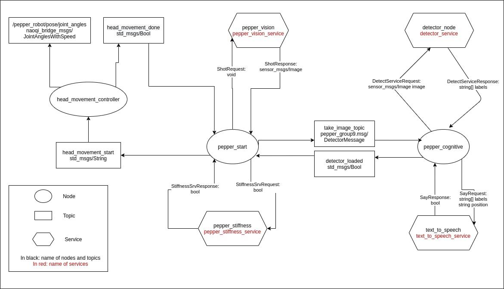

# README

This repository contains the proposed solution for the assigned project "Pepper Sociale" in the course of Cognitive Robotics, master degree in Computer Engineering @ Università degli Studi di Salerno.

- [README](#readme)
  - [Team](#team)
  - [Setup](#setup)
  - [Architecture](#architecture)
  - [Detector](#detector)
  - [Launch](#launch)
  - [How to use](#how-to-use)
    - [How it works](#how-it-works)
  - [Project Structure](#project-structure)


## Team

The team is composed by:
- Angellotto Daniele matr. 0622701082
- Barbella Michele matr. 0622701341
- Cavalcante Marco matr. 0622701209
- Vigliotti Vincenzo matr. 0622701206

## Setup

Ros package you need to install:
```
naoqi_bridge
naoqi_bridge_msgs
pepper_robot
pynaoqi-python2.7-2.5.7.1-linux64
```

## Architecture
The following scheme shows all the nodes, topics and services of the package and how they communicate:



## Detector
We used a pretrained model available at:
https://github.com/tensorflow/models/blob/master/research/object_detection/g3doc/tf2_detection_zoo.md

We decided to use the EfficientDet D1 640x640 because it offers a good trade-off between speed and performance.

## Launch

To start the package, you can use the following command:

#roslaunch pepper_group9 pepper_generic_group9.launch pip:=PEPPER_IP

where PEPPER_IP must be substituted with the IP of the Pepper robot you want to connect.

In alternative, you can use the following preconfigured launch files:

#roslaunch pepper_group9 pepper1_group9.launch
#roslaunch pepper_group9 pepper2_group9.launch

where:
- pepper1 connects to ip 10.0.1.207
- pepper2 connects to ip 10.0.1.230

## How to use

The first detection cycle begins automatically at the end of the launch phase, when all nodes are activated. Afterwards, you can do another detection cycle without rebooting the robot, using the following command on a new terminal window:

#rostopic pub head_movement_start std_msgs/String "reset"

### How it works

First of all, the launch file starts the bringup of the robot. Then all the nodes of the package are started.

The "pepper_start" node and the "pepper_cognitive" node are the heart of the package. The first calls the pepper_stiffness service provided by the "pepper_stiffness" node, in order to activate Pepper's engines. When the detector node is fully loaded, "pepper_cognitive" notices to "pepper_start" through the "detector_loaded" topic. After that the main routine begins:
- pepper_start says to head_movement_controller node the next head position through the appropriates topics;
- when a head movement ends, pepper_start uses the pepper_vision service to acquire an image by the pepper front camera, that is sent to the "pepper_cognitive" node;
- the "pepper_cognitive" node calls the detection service in the "detector_node", that examines the image and returns the list of labels of the objects detected;
- the "pepper_cognitive" node calls the pepper_speech service in order to let pepper say the list of detected objects. At the same time, pepper_start continues with the successive head movement.

In total, Pepper will acquire the images, respectively of the central view, left and right ones. 

## Project Structure

The whole project should look like in this way:

```
ProjectGroup9
├── build
├── devel
├── logs
├── src
│   ├── naoqi_bridge
│   │   └── ...
│   ├── naoqi_bridge_msgs
│   │   └── ...
│   ├── pepper_group9
│   │   ├── doc
│   │   │   └── Group_9_Graph.png
│   │   ├── efficientdet_d1_coco17_tpu-32
│   │   │   └── ...
│   │   ├── launch
│   │   │   ├── pepper_generic_group9.launch
│   │   │   ├── pepper1_group9.launch
│   │   │   └── pepper2_group9.launch
│   │   ├── msg
│   │   │   └── DetectorMessage.msg
│   │   ├── srv
│   │   │   ├── DetectService.srv
│   │   │   ├── Say.srv
│   │   │   ├── Shot.srv
│   │   │   └── StiffnessSrv.srv
│   │   ├── classmap.py
│   │   ├── CMakeLists.txt
│   │   ├── detector_node.py
│   │   ├── detector.py
│   │   ├── package.xml
│   │   ├── pepper_cognitive.py
│   │   ├── pepper_move_head.py
│   │   ├── pepper_speech.py
│   │   ├── pepper_start.py
│   │   ├── pepper_vision.py
│   │   └── pepper_wakeup.py
│   └── pepper_robot
│       └── ...
└── README.md
```
